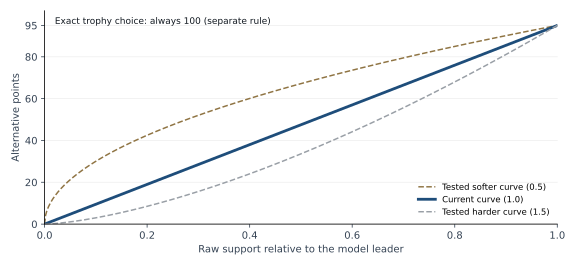
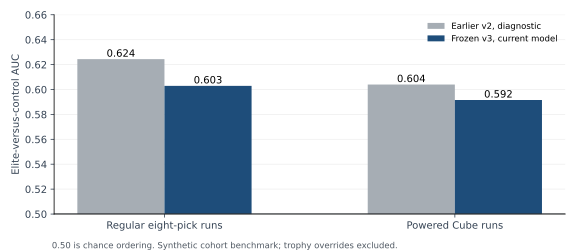

# Pack One: model, scoring and evidence

September 19, 2026 | Technical and product review | Prepared for Ryan Mindell

## 1. What the game measures

Pack One is an eight-decision comparison game built from real trophy drafts. Each round shows a real pack and the original drafter's earlier pool. The eight rounds come from eight different source drafts. Your earlier answers do not construct the pool for the next round. The game tests a series of drafting judgments; it does not simulate an entire draft table or the consequences of building your own deck.

The answer key is the trophy drafter's historical choice. Matching it earns 100. A statistical model supplies partial credit for other choices, up to 95. This distinction is deliberate: the model is useful evidence about strong-player behavior, not an authority that can prove a unique best pick or estimate the wins caused by an alternative.

The current model predicts held-out strong-player choices better than the older model on the reported development assessment. That improvement does not imply stronger skill ranking: the same study found weaker separation between higher- and lower-win-rate cohorts in eight-pick score simulations. A single Daily score should be treated as game performance, not a calibrated measure of drafting ability.

**New audit finding:** production fold exclusion is incomplete for an intermediate stage-reference statistic. Direct counts exclude the held fold, but that reference was calculated using the full training cohort. A synthetic reproduction establishes indirect held-fold influence; the effect on published scores has not been measured. This is tracked in [issue #164](https://github.com/killjoy00/mtg-ev-analyzer/issues/164). No model, corpus, Daily or historical score was changed during this review.

| Production layer | Current identity or rule |
| --- | --- |
| Predictor | strong-player-colour-stage-v3 |
| Main puzzle corpus | elite-trophy-colour-stage-v7 |
| Award rule | trophy-consensus-v3: trophy 100; alternatives 0-95 |
| Display transformation | Exponent 1.75, then normalize within the pack |
| Alternative-score curve | Linear in raw leader-relative support |
| Difficulty | support-ratio-v1; ambiguity between the top two raw supports |
| Run selection | eight-pick-v4; eight distinct source drafts |
| New-puzzle eligibility | trophy-implied-score-20-v1 |
| Traditional inventory | Additional puzzle sources; Premier-trained grader unchanged |

The discussion below separates current production behavior, measured historical research, and unverified claims. Source files and reproducibility references appear in Section 11.

## 2. Where the evidence comes from

The pipeline ingests public 17Lands draft and game archives. Draft records provide the offered cards, historical choice, pool, draft identity, draft position, and available player-experience/skill buckets. Game records support source outcome verification and the color-fit training tables. Card metadata and image references are resolved separately; artwork and marketplace prices do not determine scores.

There are two different populations. The model learns from a broader qualified strong-player cohort, including non-trophy drafts. Playable puzzles come from qualified trophy trajectories. A trophy finish alone does not bypass the experience and source-quality requirements.

For modern Premier archives, the selection starts with at least 100 prior games and a per-set high-win-rate cohort, nominally the top 15% of reported win-rate buckets. Ties at a bucket boundary mean the realized fraction can exceed 15%. The trophy importer also retains the published cohort cutoff and a 0.60 floor. Training uses a deterministic hash order and a cap of 5,000 drafts per set. Older archives without usable win-rate fields use the documented independently observed rank proxy; that is an evidence limitation, not equivalent individual player-skill measurement.

Premier trophies include 7-0, 7-1 and 7-2. Traditional puzzle trophies are qualified 3-0 trajectories. The pinned full Premier source audit found 93,752 legal sources: 12,499 at 7-0, 32,631 at 7-1 and 48,622 at 7-2. It also found nine older 7-3 sources, representing 97 retained decisions. Those sources are excluded from new selection; historical puzzle records were retained.

Before a puzzle can serve, the pipeline checks source identity, outcome consistency, contiguous real trajectory, candidate and historical-pick validity, pool reconstruction, model evidence, metadata/images, checksums and serving policy. Missing cards or missing opening packs are not invented. In Powered Cube the first complete archived pack is P1P2; its real P1P1 card remains visible in the pool.

The 5,000-draft cap is a reproducibility parameter, not a claim that larger datasets cannot help. Earlier exploration found small gains from raising it. Changing it on an already-published corpus requires a new version and fresh evaluation, because a different training cohort can change partial-credit scores.

## 3. How the model produces support

This is an offline, interpretable statistical model. It is not an LLM answering each pick, and it does not call a generative model during gameplay. Builds compute per-card support and store it with versioned puzzles. The server later reads that frozen evidence to grade an answer.

The production model does not blend GIH win rate or IWD directly into the score; those outcome features were a separate research question, and no such blend is promoted here.

The model combines three terms: a card's base pick tendency, its observed relationship to cards already in the pool, and a format-wide color-commitment adjustment. Parameters are fixed in the current implementation rather than tuned separately for each player or run.

### Base tendency and sparse-data fallback

The model first asks how often qualified drafters picked a card when it was available at this stage. It uses a specific pack/pick cell if at least 20 observations exist, a pack-wide cell if at least 30 exist, and a broader card-level estimate otherwise. Additive pseudo-counts keep thin observations from becoming extreme certainties.

| Available evidence | Raw base tendency |
| --- | --- |
| Exact pack/pick cell, at least 20 seen | (picked + 1.5) / (seen + 7.5) |
| Pack-level cell, at least 30 seen | (picked + 2.0) / (seen + 10.0) |
| Any card-level observations | (picked + 2.0) / (seen + 12.0) |
| No observations | 0.01 |

These are empirical tendencies conditioned on availability, not independent probabilities that each card is correct. They must be compared and normalized within the actual offered pack.

### Pool co-pick adjustment

For each candidate and each card already in the pool, the model counts how often that candidate was seen and chosen. Pairs with fewer than eight observations are ignored. The pair estimate is shrunk toward a stage-matched reference with prior strength 24. The difference is calculated on the log-odds scale.

Pairs receive more weight as evidence increases, up to a cap. Multiple copies of a pool card increase its weight modestly, also capped. The weighted average pool effect is multiplied by 0.75 and by a commitment factor that grows with pool size until eight cards. This avoids applying a full late-draft context adjustment to an almost empty pool.

Stage matching matters because pool-card relationships are naturally observed later than opening-pack choices. Without it, a change associated with draft position can be mistaken for synergy. The new isolation finding concerns how that stage reference is built for production folds; the intended adjustment remains useful, but the strict exclusion implementation needs correction before the next model release.

### Color commitment

The model also uses a format-wide relationship between color commitment, draft stage and eventual deck inclusion. It does not fit a separate causal deck-value model for each card. The log-odds difference between the relevant commitment cell and its stage reference is multiplied by 0.75.

Unknown color information contributes no adjustment. Thin stage cells fall back to the marginal commitment curve. Color tables are built from eligible training evidence and exclude served source drafts in the production builder. The production importer and research harness have distinct build paths, so provenance must be checked for both.

Conceptually: tendency = logistic(logit(base) + 0.75 x pool-depth factor x pair lift + 0.75 x color shift). Tendencies are normalized over the offered candidates. The stored field is called model_probability, but it is raw normalized model support; it should not be described as a proven probability of correctness.

## 4. From support to displayed percentages and points

Let q be a card's raw stored support and q_max the largest support in the pack. Let r = q / q_max. Normalization does not change this ratio.

**Displayed support:** p_i = q_i^1.75 / sum(q_j^1.75).

**Award:** 100 for the historical trophy choice; otherwise round(95 x r), bounded by the validated support ratio between zero and one.

**Run score:** round((score_1 + ... + score_8) / 8). The server first rounds each pick's score, then averages those integers. Old runs retain their original length and recorded result.

| Example | Raw ratio to leader | Award |
| --- | ---: | ---: |
| Exact trophy choice, even if the model disagrees | Any valid ratio | 100 |
| Model leader that is not the trophy choice | 1.00 | 95 |
| Strong alternative | 0.80 | 76 |
| Half the leader's raw support | 0.50 | 48 |
| Lower-support alternative | 0.25 | 24 |
| Very low-support alternative | 0.10 | 10 |

These are illustrative formula examples, not observed player results. Eight illustrative awards of 100, 95, 76, 48, 100, 76, 24 and 95 sum to 614 and produce a run score of 77.

Displayed percentages are not directly multiplied by 95. If the raw support ratio is 0.5, the displayed ratio is approximately 0.297 after the 1.75 power. The score remains 48. Applying 95 directly to the displayed ratio would incorrectly award about 28. The equivalent conversion from unrounded displayed ratios uses the inverse exponent 1/1.75; production computes from raw support to avoid rounding errors.

The trophy override is outside this curve. It is a product rule identifying the target answer, not evidence that the historical pick was universally optimal. A trophy draft succeeds across many decisions, matchups and game outcomes; its success does not prove that each individual choice caused the result.

The September 18 scoring study separately fitted a display exponent of 1.5 for v3. It did not promote that fit into production. An older diagnostic applied exponent 2 to both models; it also is not the live v7 setting. The live display exponent remains 1.75. This review corrected a guide that incorrectly described production as 2.

## 5. Difficulty and selection change what players encounter

Difficulty measures ambiguity between the model's two leading choices: round(100 x second-highest raw support / highest raw support). Easy is 0-49, medium 50-79, and hard 80-100. A high rating means the model's leading options are close. It does not mean a particular fraction of humans will answer incorrectly.

New runs target one easy, five medium and two hard decisions. Easy is placed within the first five rounds and a hard decision within the last three. If easy inventory is unavailable it can become medium; medium/hard shortages fail rather than quietly changing the requested composition. All eight questions have equal score weight.

The separate serving floor requires the historical trophy choice's hypothetical partial credit to satisfy round(95 x q_trophy / q_max) >= 20. That excludes severe target/model disagreements from newly generated games. It is a per-puzzle rule, not a requirement that the model agree with trophy players 20% of the time. Because of rounding, the exact mathematical threshold is 19.5/95, about 0.205263; implementation parity checks preserve floating-point boundaries. A served trophy match still earns 100.

| Mode | Source composition and pick positions |
| --- | --- |
| Mixed Daily | At least two from newest Live release; four from previous-three pool; two recency-weighted full-corpus draws. P1P1-P1P8. |
| Latest Set Daily | Eight decisions only from newest released Live regular set, P1P1-P1P8; no older-set fallback. |
| Powered Cube Daily | Eight complete archived decisions, P1P2-P1P9. |
| Elite custom practice | User-selected eligible sets, balanced across eight decisions: 8; 4/4; 3/3/2; 2/2/2/2. |

The mixed Daily uses release-date metadata and a weight of 2^(-rank/4), a half-life of four releases. Set choice is not proportional to database size. A 100,000-plan simulation produced 87.5993% exposure to the newest four sets and 29.0029% to the newest set, while satisfying the fixed quotas. The predecessor guarantee is across that three-set pool; it does not require every predecessor each day.

Every round uses a different source draft. Dailies are fixed per Eastern date, resume the first attempt and offer no rerolls. Shared practice preserves the exact eight decisions. Unshared practice rerolls remain constrained by difficulty, source uniqueness and the selected environment. These controls limit easy-score shopping; they do not eliminate anonymous multi-browser play or make one eight-pick score a stable skill estimate.

## 6. How the assessment was designed

The authoritative recent scoring report is the frozen-v3 experiment from September 18, not every exploratory result in older documentation. It used six pinned draft/game archive pairs: TMT, HOB, BLB, MSH, SOS and Powered Cube. Checksums, model implementation identities, cache identities and train-table provenance accompany the measurements. Changed inputs should fail reproducibility checks rather than silently substitute new data.

The research harness starts with a deterministic 60% training, 15% validation and 25% test split by draft identity. Within the validation portion, a second independent hash assigns whole drafts to calibration, curve selection or assessment. All decisions from one draft remain together. The reported frozen-v3 scoring assessment reused development archives; it was not a fresh untouched temporal test. Player identities are unavailable, so draft separation does not demonstrate generalization to entirely unseen players.

The model was frozen before choosing a score curve. Candidate raw-support exponents were 0.5, 0.75, 1, 1.25 and 1.5. Exponents below one make alternatives more generous; above one make them harsher. The incumbent was the same v3 model with exponent one. The old v2 model was a diagnostic comparison and could not win this curve-selection decision.

The primary curve metric was eight-pick cohort AUC: the chance a simulated elite-cohort run outscores a simulated equally experienced lower-win-rate control run, counting ties as half. A candidate needed a positive paired 95% improvement interval and could not increase any measured set's strong-choice below-25 rate by more than one percentage point. Selection was frozen before assessment; there was no fallback choice after looking at assessment results.

Each environment used 2,000 simulated eight-decision runs. There were 200 source-draft bootstrap draws, with 500 runs per draw. Runs matched the measured set, pick-window and difficulty-cell distributions and used eight distinct sources. Bootstrap resampling occurs at source-draft level because picks from one draft are correlated. Treating every pick or simulated run as an independent observation would overstate precision.

The simulation renormalized the Daily selection policy to its five measured regular sets plus Cube. It did not replay the full production catalog. It compared observed choices in matched states, not the same people choosing among identical packs. Trophy overrides were excluded only from this underlying-quality benchmark: awarding 100 to every observed reference pick would make the comparison meaningless. Runtime tests separately enforce trophy = 100.

## 7. What the measured results show

The assessment contained 20,297 elite decisions and 13,889 control decisions. Predictive results below use the elite assessment decisions. Lower log loss and Brier score are better; higher top-choice accuracy is better. Log loss rewards assigning support to the observed choice and penalizes confident misses. Brier score measures squared probability error. Neither establishes the causal value of a card.

| Raw prediction metric | Earlier v2 | Frozen v3 |
| --- | ---: | ---: |
| Top-choice accuracy | 52.722% | 55.200% |
| Log loss | 1.48103 | 1.34302 |
| Brier score | 0.67425 | 0.62611 |
| Mean rank of observed choice | 2.0987 | 1.9905 |

The pooled paired raw log-loss change was -0.13801, with 95% interval -0.14141 to -0.13448. Top-choice accuracy improved by 2.478 percentage points, interval +2.053 to +2.983. These support a predictive improvement on this assessment. They do not prove a universal improvement on all sets, future sets or every product objective.

Calibration was measured separately. With the study's fitted exponent, v3 log loss was 1.26184 and confidence expected calibration error was 0.03858. Raw v3 confidence ECE was 0.15903. ECE compares binned predicted confidence with observed frequencies; it depends on the sample and binning and is not an all-purpose reliability certificate. The fitted exponent here was 1.5, not the current production 1.75. No directly corresponding current-1.75 assessment result is claimed from this table.

| Eight-pick benchmark, linear curve | Regular | Cube |
| --- | ---: | ---: |
| Frozen v3 cohort AUC | 0.60291 | 0.59155 |
| Diagnostic v2 cohort AUC | 0.62435 | 0.60397 |
| Frozen v3 elite mean score | 75.372 | 72.056 |
| Frozen v3 control mean score | 71.741 | 68.793 |

These are synthetic underlying-support scores without trophy overrides, not expected live Daily averages. An AUC around 0.60 means limited separation in this benchmark. It is not a 60% chance that a player is elite, and not 60% card-picking correctness. V3 improved next-pick prediction while reducing this particular skill-cohort separation measure relative to v2.

No alternative v3 curve met the predeclared replacement rule. The linear curve was retained for both environments. On assessment, the most generous tested curve improved regular AUC by only 0.00128 (interval -0.00233 to +0.01320), and Cube by 0.00343 (-0.00428 to +0.01110). These intervals include zero. Harsher curves also failed to establish an improvement. Changing the curve to create a larger visible point spread would not, by itself, add measured skill information.

## 8. Why Traditional puzzles do not imply Traditional training

Two studies answer different questions: whether Traditional drafts should help train the model, and whether Traditional trophy trajectories are suitable playable puzzles graded by the frozen Premier model. Passing the second does not authorize the first.

The four-set Premier/Traditional training study retained Premier-only training because the full predeclared pooling criteria were not met. Combined training did improve pooled Premier log loss from 1.23521 to 1.22464 on the sufficient BLB/DFT/FIN sample. However, Traditional-only prediction on Premier was weaker, and the required cross-format tolerance failed. Traditional samples were much smaller, so this does not prove inherently different drafting policies. HOB had only 48 Traditional test drafts, below the required 50, and stayed descriptive.

Playable-source Phase 2 separately passed 22 regular environments. Production now has 21 regular supplemental components Live: BLB, BRO, DFT, DMU, DSK, EOE, FDN, FIN, LCI, LTR, MH3, MKM, MOM, MSH, NEO, ONE, OTJ, SNC, SOS, TDM and WOE. SIR's passing component remains Candidate because its parent is Candidate. Failed HOB, KTK, HBG and PIO Traditional inventory remains excluded. These names describe Traditional admission; their Premier lifecycle is a separate question.

Traditional Powered Cube is restricted to the separately reviewed P1P2-P1P7 component. Its original P1P2-P1P9 experiment failed; P8/P9 remain Premier-only. The restricted converter admitted 220 qualified trajectories, 1,320 decisions and 1,295 interesting decisions before the serving floor. No missing P1P1 pack was fabricated. There are no event-type quotas in normal selection; eligible published decisions share the relevant set/pick/difficulty pool.

Source admission checked trajectory sufficiency, unusable fraction, support-score shifts, low-support tails, target disagreement, difficulty distribution and calibration against fixed tolerances. For example, the protocol allowed at most a three-point increase in the low-support fraction, ten points in target disagreement, 0.15 total-variation difference in difficulty, and an eight-point mean support-score drop, subject to its stated uncertainty rules. These are predeclared engineering/product tolerances, not mathematical proofs of equivalence.

Actual production release checks verified post-floor inventory, 40 new Daily selections totaling 320 decisions, 25 eligible single-set custom paths, source uniqueness and preserved historical reads. Research pass/fail, lifecycle publication and runtime deployment were verified separately.

## 9. Isolation finding and the limits of the evidence

The production builders compute pair_expected in a second pass using a base model trained on all training counts. To grade a held fold, the runtime model subtracts that fold's direct counts and its expected contributions. However, the expected contributions remaining for other folds still use base rates influenced by the held fold. The strict claim that the held fold cannot influence its grader is therefore too strong.

The audit held 40 training observations fixed and changed only the labels of 20 held observations. After subtraction, the remaining A counts stayed at 40 seen and 20 picked, and the base tendency stayed 0.45263157894736844. The stage reference changed from 0.614814814814814 to 0.31851851851851853; final A tendency changed from 0.44579019654703567 to 0.4639579602884164. This is a deliberately simple synthetic dependency test, not a measured production score change, bias estimate or exploit demonstration.

The independent evaluation harness builds counts and pair expectations from training draft IDs before evaluating assessment drafts. That path is distinct from subtracting production folds after fitting the reference. The finding therefore does not automatically invalidate the published disjoint-split assessment. It does require a fresh exact-implementation audit and prevents an unconditional certification of production holdout purity.

The appropriate correction is to build each fold's stage reference using only that fold's training complement, add a held-label invariance regression, and measure changes on pinned real archives. Candidate order, support ratios, awarded points, serving-floor eligibility and source selection all need comparison. Because model evidence is frozen into puzzle identities, correction must use an explicit new model/corpus version and preserve old results. Quietly rebuilding the existing version would break reproducibility.

Other material limits remain: the source population is self-selected 17Lands users; bucketed skill estimates and legacy proxies are imperfect; some formats have sparse evidence; color affinity is inferred and may miss unusual cards; the latest assessment reused development sources; bootstrap intervals condition on fitted models; no causal win-value claim is supported; and there is no fresh population-scale proof that current Daily scores reliably rank human skill.

Older experiments also contain documented implementation defects and superseded hypotheses. Their attractive headline numbers should not be mixed with the frozen-v3 assessment. A historical green result certifies its archived implementation and data, not every later edit bearing a similar model name.

## 10. What is safe to claim, and what comes next

Pack One can accurately claim that it uses real qualified trophy decisions, awards exact matches 100, gives reproducible model-based partial credit to alternatives, and preserves versioned historical results. It can explain that v3 improved prediction in the specified development assessment and that the tested linear score curve was retained under a predeclared rule.

It should not claim objective perfect picks, causal expected wins, a validated overall player rating from one Daily, newly untouched assessment data, complete production fold isolation, or real-world revenue/learning improvements without corresponding measurements.

The first model priority is issue #164: correct and measure fold-isolated stage references before the next model promotion. The next useful evidence is prospective performance on genuinely new archives and real non-QA first-encounter behavior. Existing decision telemetry can study completion, abandonment, time and answer distributions, with appropriate cohort definitions. Repeated play may help estimate stability, but simply averaging more results does not remove model or source-population bias.

A separate versioned calibration experiment can decide whether to replace the current display exponent; it need not change points. New model families, higher training caps or Traditional pooling require their own frozen comparison and score-movement analysis. No such promotion was made by this report. The production site keeps the existing model and score contract while these limitations are recorded honestly.

## 11. Sources and reproducibility

This report audits repository source, pinned research artifacts and production release evidence available on September 19, 2026. It does not rerun the expensive training experiments or claim a new independent statistical replication. The new synthetic isolation check was run during this audit. The handoff closeout report records the final application deployment separately; application releases do not change the model identity listed here.

- [Frozen scoring protocol](https://github.com/killjoy00/mtg-ev-analyzer/blob/main/results/rebuild-2026-09-18/SCORING-PROTOCOL.md), [results](https://github.com/killjoy00/mtg-ev-analyzer/blob/main/results/rebuild-2026-09-18/SCORING-RESULTS.md), and [machine-readable report](https://github.com/killjoy00/mtg-ev-analyzer/blob/main/results/rebuild-2026-09-18/scoring-report.json). Workflow 35350883338; research revision 9876dd93ae7c914e05b149807e16c816c278f027.
- [Production model implementation](https://github.com/killjoy00/mtg-ev-analyzer/blob/main/scripts/build_replays.py), [trophy importer](https://github.com/killjoy00/mtg-ev-analyzer/blob/main/scripts/import_all_trophies.py), [research harness](https://github.com/killjoy00/mtg-ev-analyzer/blob/main/scripts/eval_model.py), and [scoring implementation](https://github.com/killjoy00/mtg-ev-analyzer/blob/main/draft-run.mjs).
- [Automated scoring methodology](https://github.com/killjoy00/mtg-ev-analyzer/blob/main/docs/AUTOMATED-SCORING.md), [difficulty and scoring contract](https://github.com/killjoy00/mtg-ev-analyzer/blob/main/docs/SCORING-AND-DIFFICULTY.md), and [Daily distribution evidence](https://github.com/killjoy00/mtg-ev-analyzer/blob/main/results/rebuild-2026-09-18/DAILY-DISTRIBUTION.md).
- [Premier/Traditional training results](https://github.com/killjoy00/mtg-ev-analyzer/blob/main/results/rebuild-2026-09-18/TRADITIONAL-RESULTS.md), workflow 35349969472; [source admission](https://github.com/killjoy00/mtg-ev-analyzer/blob/main/docs/TRADITIONAL-PUZZLE-ADMISSION.md), Phase 2 workflow 35386149822; [production publication evidence](https://github.com/killjoy00/mtg-ev-analyzer/blob/main/results/release-2026-09-19/production-verification.json).
- [Production isolation follow-up #164](https://github.com/killjoy00/mtg-ev-analyzer/issues/164). Includes reproduction values and acceptance requirements for a future versioned correction.

Reproduction should start from the pinned source checksums and exact implementation recorded in each experiment. Keep source-draft partitions fixed, verify train-table provenance, freeze curve selection before assessment, and record any mismatch. A changed input or predictor is a new experiment, not a rerun of the old result.
